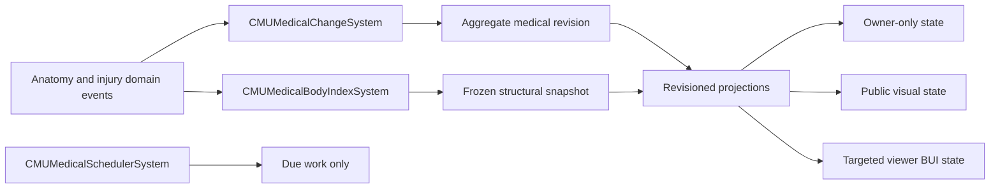

# CMU medical architecture

The medical stack is organized around a server-owned aggregate. Runtime cost should scale with actual medical mutations, due work, and active viewers instead of multiplying every medical system by every entity on every tick.

## Module boundaries

### Body index and aggregate

`CMUMedicalBodyIndexSystem` owns canonical body-part and organ lookup for CMU bodies, including part-to-organ, organ-to-part, and occupied/empty organ-slot relationships. Its index, aggregate, and snapshots are server-only. Shared callers use the index on the server and fall back to the normal body hierarchy on clients so prediction remains valid.

Structural and medical revisions are intentionally separate:

- The structural revision changes only when parts or organs are added, removed, or replaced. It invalidates the frozen anatomy snapshot.
- The medical revision changes for injury, organ, pain, treatment, surgery, and visual mutations. It invalidates medical projections without rebuilding an unchanged anatomy traversal.

Callers must not retain mutable body collections. They use canonical lookup, ordered enumeration, or the immutable snapshot.

### Change journal

`CMUMedicalChangeSystem` fans fine-grained domain events into one `CMUMedicalChangedEvent` per body per simulation tick. The event carries a medical revision and typed change flags. Existing domain events remain synchronous and continue to support gameplay logic; the coalesced stream is for caches, projections, and other fan-out consumers.

Public projections are tick-coherent: multiple mutations in one tick become one rebuild on the journal flush. Code and tests that read a projection after mutating authoritative state must cross that flush boundary rather than assuming same-call reconstruction.

Domain events that have both part-local behavior and body-wide consumers are raised once as a directed event with `broadcast: true`. This keeps local ECS handlers and aggregate subscribers on the same mutation without duplicating event objects or silently missing one side of the fan-out.

### Due-time scheduler

`CMUMedicalSchedulerSystem` is shared infrastructure with a server-authoritative scheduling guard. It owns sparse, keyed deadlines. Scheduling the same entity/key replaces the prior deadline, cancellation and entity deletion suppress stale work, pause/unpause preserves remaining duration, and an immediate self-reschedule cannot spin inside the same drain.

`CMUMedicalSchedulerDispatchSystem` owns the server update phase and drains due work after damage and respiration. This preserves timing-sensitive feature ordering while allowing shared systems to register deadlines without client-side dispatch.

Use it for expiry and interval work with a known next deadline. Continuous physiology that genuinely needs fixed-step integration remains in its owning simulation system.

Pain feedback, temporary vision effects, cast healing/removal prompts, post-op malunion checks, armed surgery expiry, limb-printer visuals, Autodoc procedure steps, and scanner boost/lockout expiry use keyed due work. Replacing a deadline replaces the existing key rather than adding another active timer.

### Surgery registry

Surgery entity prototypes and CMU metadata compile into immutable `CMUSurgeryDefinition` objects on prototype load/reload. Steps are joined by typed `StepId`, never by list position. Eligibility is pre-indexed by body-part type, and invalid duplicate, missing, or unknown metadata fails before the registry is swapped. An active attempt captures the exact compiled step ID; a surgery prototype reload invalidates live sessions instead of allowing an old action to execute a newly reordered or replaced step.

### Surgery sessions

Manual surgery execution is serialized by one server-owned `CMUSurgerySessionComponent` on the patient. A session has a stable identity, logical body site, procedure, current step, and explicit phase: `AwaitingAction`, `Performing`, or `AwaitingDecision`.

The session has no owner and no claim/release lifecycle. Any qualified surgeon may begin the next action while the session is awaiting action. Only the active attempt records a surgeon, tool, target, exact step ID, and monotonically increasing attempt token. Starting a second action while one is performing is rejected. Completion or cancellation must present the exact current token and matching action participants; stale and duplicate callbacks are ignored. Only the surgeon performing an action may abandon it, but once the action stops any qualified surgeon may continue or abandon the waiting procedure. Cancellation returns the same session and armed step to awaiting action so another surgeon can continue without recovery work. A reverse link on the active surgeon performs the same transition if that entity disappears, preventing disconnects from stranding a session in `Performing`.

The networked armed/in-progress/in-flight components remain compatibility projections while the legacy surgery planner and effects are migrated behind the session interface. They must not be used to authorize a surgeon or infer ownership. `CMUSurgeryInFlightComponent.Surgeon` is historical operator credit only. A pre-commit waiting selection may switch body sites; after the first step commits, the in-progress projection pins the procedure to that site until completion or explicit abandonment.

Mutating UI commands carry the exact patient, per-view render revision, session, attempt, and armed-state identities rendered to the user. The server then rebuilds the current body index, eligibility, skill, and next-step result and accepts only an exact row from that fresh projection. A delayed, replayed, forged, or cross-patient arm/abandon command therefore cannot affect a newer state. Autodoc queues likewise store logical sites for presentation and resolve them through the current occupant's body index at execution time; ejection clears machine-owned queued work.

### Wound ledger

Each body part has one ordered collection of coherent wound entries. A row owns its wound data, size, bandage progress, mechanism flags, treatment quality, and cleanup state. Production code mutates rows through the ledger interface; parallel index-aligned collections and repair passes are forbidden.

Raw wound detail is server-owned. Other clients receive compact body-level overlay and examine projections instead of the per-part ledger. Scanner details are built by the server for the authorized interaction.

## Projection ownership

- Owner-only: private feedback and controls, such as pain tier, aim accuracy, and body-zone targeting.
- Public: compact appearance facts required to render another entity, such as bandage, splint, and damage overlay levels.
- Targeted viewer: skill- and viewer-dependent scanner/autodoc state, sent directly to each actor with that UI open.
- Server-only: raw wounds, structural indexes, aggregate caches, scheduler state, and rulebook internals.

Never put viewer-dependent data in a global `BoundUserInterfaceState`. Never send raw internal ledgers merely to derive a small visual on the client.

Scanner anatomy lines and calibration puzzle signals are cached per patient, medical revision, and simulation tick. Multiple open consoles/viewers reuse these expensive viewer-independent projections while live vitals, permissions, progress, and assignments remain freshly composed for each state.

## Performance invariants

1. A repeated canonical body lookup does not traverse the body hierarchy.
2. A structural snapshot is built at most once per structural revision.
3. Fine-grained mutations cause at most one aggregate change event per body per tick.
4. A due-time feature does not scan all entities to discover that nothing is due.
5. Closed machines build and send no periodic UI projection.
6. Two viewers may receive different machine permissions without overwriting or leaking one another's state.
7. Scanner presentation consumes typed severity/kind/range fields and never parses localized diagnostic text for meaning.
8. Surgery metadata order cannot change step behavior.
9. A wound row cannot become misaligned from its treatment metadata.
10. Read-only medical callers outside the body-index module do not traverse anatomy containers directly; structural mutation paths may use container APIs to perform the attachment or removal itself.
11. A surgery session has at most one performing attempt, and only its exact token may advance or cancel that attempt.

## Adding medical behavior

Place authoritative state and mutations on the server unless prediction or presentation requires a shared field. Raise the narrow domain event first, mark the aggregate with the appropriate change flags, and have downstream caches or projections subscribe to the coalesced event. Schedule known deadlines through the medical scheduler. Add network state only at one of the explicit projection boundaries above.
